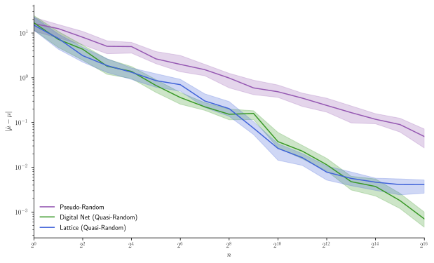
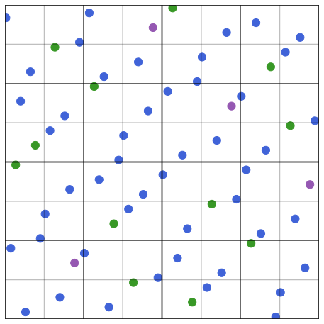

```@meta
DocTestSetup = quote
    using QMCGenerators
    using CairoMakie
    using Random: MersenneTwister
    using Distributions
    using LinearAlgebra
end
```

# Tutorial

```@contents
Pages = ["tutorial.md"]
Depth = 4
```

To begin, install this package with 

```julia 
Pkg.add("QMCGenerators")
```

and then import via

```julia
using QMCGenerators
```

## Common Usage

Often we just want to generate a single randomized quasi-random sequence. For example, to generate the first $4$ points of a $3$ dimensional lattice with 1 random shift with seed 7

```jldoctest
Next(RandomShift(LatticeSeqB2(3),1,7),4)
# output
4×3 Matrix{Float64}:
 0.243795  0.719182  0.810814
 0.743795  0.219182  0.310814
 0.993795  0.469182  0.560814
 0.493795  0.969182  0.0608139
```

A similar API is available for digital sequences with an additional seed 11 for the linear matrix scrambling

```jldoctest
Next(RandomDigitalShift(DigitalSeqB2G(LinearMatrixScramble(3,11)),1,7),4)
# output
4×3 Matrix{Float64}:
 0.243795  0.719182  0.810814
 0.765309  0.217124  0.433938
 0.586294  0.922505  0.665123
 0.420247  0.389167  0.0420291
```

!!! warning
    While not strictly enforced, sample sizes should be powers of two to achieve full coverage of $[0,1]^s$

In the following sections we always supply a seed for reproducibility. Supplying a seed requires you also supply the number of randomizations as done above. However, if you do not wish to seed, you can simply supply the number of randomizations. 

```jldoctest tut_no_seed
rls = RandomShift(LatticeSeqB2(12),2)
xs = NextR(rls,2^7)
size(xs)
# output
(2,)
```
```jldoctest tut_no_seed
size(xs[1]) == size(xs[2]) == (2^7,12)
# output
true
```

Moreover, you may use only one randomization without a seed with the simplified API
```jldoctest
rls = RandomShift(LatticeSeqB2(52))
x = Next(rls,2^14)
size(x)
# output
(16384, 52)
```

The same API simplifications holds for digital sequences  

```jldoctest
rds = RandomDigitalShift(DigitalSeqB2G(LinearMatrixScramble(52)))
x = Next(rds,2^14)
size(x)
# output
(16384, 52)
```

## Structure and Functions

### Unrandomized Sequences

!!! warning
    It is highly recommended you randomize sequences. The first point of an unrandomized sequence is $0 \in [0,1]^s$ which will be transformed to an infinite values in many functions e.g. those composed with taking the inverse CDF of a $\mathcal{N}(0,1)$ as done in the section on [Quasi-Monte Carlo](@ref). 


Let's start by defining a 5 dimensional (unrandomized) digital sequence and generating the first 4 points.

```jldoctest tut_ds
ds = DigitalSeqB2G(5)
Next(ds,4)
# output
4×5 Matrix{Float64}:
 0.0   0.0   0.0   0.0   0.0
 0.5   0.5   0.5   0.5   0.5
 0.75  0.25  0.25  0.25  0.75
 0.25  0.75  0.75  0.75  0.25
```

We can then generate the next 4 points in the sequence with 

```jldoctest tut_ds
Next(ds,4)
# output
4×5 Matrix{Float64}:
 0.375  0.375  0.625  0.875  0.375
 0.875  0.875  0.125  0.375  0.875
 0.625  0.125  0.875  0.625  0.625
 0.125  0.625  0.375  0.125  0.125
```

To reset the generator use

```jldoctest tut_ds
Reset!(ds)
Next(ds,4)
# output
4×5 Matrix{Float64}:
 0.0   0.0   0.0   0.0   0.0
 0.5   0.5   0.5   0.5   0.5
 0.75  0.25  0.25  0.25  0.75
 0.25  0.75  0.75  0.75  0.25
```

Let's reset once more before continuing 

```jldoctest tut_ds; output = false
Reset!(ds)
# output
```

These functions can also be applied to Lattices 

```jldoctest tut_ls
ls = LatticeSeqB2(5)
Next(ls,4)
# output
4×5 Matrix{Float64}:
 0.0   0.0   0.0   0.0   0.0
 0.5   0.5   0.5   0.5   0.5
 0.75  0.75  0.75  0.75  0.75
 0.25  0.25  0.25  0.25  0.25
```
```jldoctest tut_ls
Next(ls,4)
# output
4×5 Matrix{Float64}:
 0.875  0.375  0.875  0.375  0.375
 0.625  0.125  0.625  0.125  0.125
 0.375  0.875  0.375  0.875  0.875
 0.125  0.625  0.125  0.625  0.625
```
```jldoctest tut_ls; output = false
Reset!(ls)
# output
```

### Randomized Sequences 

A random shift may be applied to Lattice sequences with the API shown in the [Common Usage](@ref) section.

Digital sequences have multiple randomization options available.

- **Owen's scrambling** maximally randomizes a sequence, but is slow to compute. 
```jldoctest
rds = RandomOwenScramble(DigitalSeqB2G(3),1,7)
Next(rds,4)
# output
4×3 Matrix{Float64}:
 0.346099  0.289927  0.564151
 0.994684  0.621427  0.372878
 0.698052  0.24576   0.977445
 0.196841  0.88248   0.112319
```
- **Digital shifts** provide a less thorough randomization, but are very fast to compute.
```jldoctest
rds = RandomDigitalShift(DigitalSeqB2G(3),1,7)
Next(rds,4)
# output
4×3 Matrix{Float64}:
 0.243795  0.719182  0.810814
 0.743795  0.219182  0.310814
 0.993795  0.969182  0.560814
 0.493795  0.469182  0.0608139
```
- **Linear matrix scrambling** with digital shifts provide a nice compromise in both randomization completeness and speed. This is the example shown in the [Common Usage](@ref) section. Owen scrambling with LMS is also available. 
```jldoctest
rds = RandomOwenScramble(DigitalSeqB2G(LinearMatrixScramble(3,11)),1,7)
Next(rds,4)
# output
4×3 Matrix{Float64}:
 0.346099   0.289927  0.564151
 0.55935    0.563788  0.490661
 0.817567   0.210437  0.972962
 0.0845407  0.996624  0.248283
```

!!! warning
    Linear matrix scrambling randomizes the generating matrix but does not randomize the sequence. The first point of a digital sequence with LMS is still $0 \in [0,1]^s$ as shown in the following example. 
    ```jldoctest
    ds = DigitalSeqB2G(LinearMatrixScramble(3,11))
    Next(ds,4)
    # output
    4×3 Matrix{Float64}:
     0.0       0.0       0.0
     0.990266  0.560686  0.627061
     0.658173  0.328935  0.397781
     0.335878  0.858341  0.770812
    ``` 
    A digital shift or Owen scramble should be applied to the digital sequence with LMS in order to randomize the sequence. 

Linear matrix scrambling is applied directly to the generating matrix of a digital sequence e.g. the following code applies an LMS to the first 3 dimensions of the default generating matrix with seed 11.
    
```jldoctest
rds = LinearMatrixScramble(3,11)
rds.Csrlms[1:3,1:3]
# output
3×3 Matrix{BigInt}:
 8919527391347378  3025319916407160  1464034688344015
 5050214857409105  7731249259815715  6461603654309845
 5648063034791762  6942855285482651  2573696225362753
```

An explicit generating matrix or path to an existing generating matrix may also be supplied as discussed in the [Alternative Generating Matrices and Vectors](@ref) section. 


###  Independent Sequence Randomizations

Getting a single randomization was shown in the [Common Usage](@ref) section. Support is also available for multiple independent randomizations. For instance, we can generating 2 independent randomizations with seed 11 and get the next 4 points in each sequence via  

```jldoctest tut_ds
ds = DigitalSeqB2G(5)
rds = RandomDigitalShift(ds,2,11)
xs = NextR(rds,4)
typeof(xs)
# output
Vector{Matrix{Float64}} (alias for Array{Array{Float64, 2}, 1})
```
```jldoctest tut_ds
xs[1]
# output
4×5 Matrix{Float64}:
 0.58051    0.862848  0.861659  0.919821  0.35264
 0.0805097  0.362848  0.361659  0.419821  0.85264
 0.33051    0.612848  0.611659  0.669821  0.60264
 0.83051    0.112848  0.111659  0.169821  0.10264
```
```jldoctest tut_ds
xs[2]
# output
4×5 Matrix{Float64}:
 0.714139  0.702579  0.0130147  0.901326  0.280776
 0.214139  0.202579  0.513015   0.401326  0.780776
 0.464139  0.952579  0.263015   0.651326  0.530776
 0.964139  0.452579  0.763015   0.151326  0.0307758
```

As with unrandomized sequences, we can get the next 4 points and then reset the generator with 

```jldoctest tut_ds
xs = NextR(rds,4)
xs[1]
# output
4×5 Matrix{Float64}:
 0.95551  0.737848  0.486659  0.0448206  0.22764
 0.45551  0.237848  0.986659  0.544821   0.72764
 0.20551  0.987848  0.236659  0.294821   0.97764
 0.70551  0.487848  0.736659  0.794821   0.47764
```
```jldoctest tut_ds
xs[2]
# output
4×5 Matrix{Float64}:
 0.839139   0.827579   0.638015  0.0263257  0.155776
 0.339139   0.327579   0.138015  0.526326   0.655776
 0.0891388  0.577579   0.888015  0.276326   0.905776
 0.589139   0.0775787  0.388015  0.776326   0.405776
```
```jldoctest tut_ds; output = false
Reset!(rds)
# output
```

Similarly for Lattices 

```jldoctest tut_ls
rls = RandomShift(ls,2,11)
xr = NextR(rls,4)
xr[1]
# output
4×5 Matrix{Float64}:
 0.498434  0.26454    0.676602  0.46979  0.677608
 0.998434  0.76454    0.176602  0.96979  0.177608
 0.248434  0.0145404  0.426602  0.21979  0.427608
 0.748434  0.51454    0.926602  0.71979  0.927608
```
```jldoctest tut_ls
xr[2]
# output
4×5 Matrix{Float64}:
 0.389721  0.719424  0.184079  0.568002   0.105514
 0.889721  0.219424  0.684079  0.0680019  0.605514
 0.139721  0.469424  0.934079  0.318002   0.855514
 0.639721  0.969424  0.434079  0.818002   0.355514
```
```jldoctest tut_ls; output = false
Reset!(rls)
# output
```

## Advanced Features

### Alternative Generating Matrices and Vectors

#### Pregenerated

We include many alternative generating matrices for digital sequences in [this directory](https://bitbucket.org/dnuyens/qmc-generators/src/master/DIGSEQ/). To use an alternative, simply supply the relative path 

```jldoctest 
ds = DigitalSeqB2G(3,"sobolmats/sobol_alpha2_Bs64.col")
Next(ds,4)
# output
4×3 Matrix{Float64}:
 0.0     0.0     0.0
 0.75    0.75    0.75
 0.6875  0.1875  0.9375
 0.4375  0.9375  0.1875
```

Linear matrix scrambling also accepts these relative paths 

```jldoctest 
ds = DigitalSeqB2G(LinearMatrixScramble(3,"sobolmats/sobol_alpha2_Bs64.col",11))
Next(ds,4)
# output
4×3 Matrix{Float64}:
 0.0       0.0       0.0
 0.658173  0.63256   0.679829
 0.782294  0.183957  0.505698
 0.375891  0.558481  0.185488
```

Alternative Lattice generating vectors are available in [this directory](https://bitbucket.org/dnuyens/qmc-generators/src/master/LATSEQ/). For Lattices, after supplying the path you also need to pass the $m$ value in the file name

```jldoctest
ls = LatticeSeqB2(3,"exod8_base2_m13.txt",13)
Next(ls,4)
# output
4×3 Matrix{Float64}:
 0.0   0.0   0.0
 0.5   0.5   0.5
 0.75  0.75  0.25
 0.25  0.25  0.75
```

#### User Defined

One may supply their own generating matrix to construct a base 2 digital sequence, for example

```jldoctest tut_ds_custom_matrix
m = 5
C1 = [BigInt(2^i) for i=0:(m-1)]
C2 = [BigInt(1) for i=1:m]
for i in 2:m C2[i] = (C2[i-1] << 1) ⊻ C2[i-1] end
generating_matrix = vcat(C1',C2')
# output
2×5 Matrix{BigInt}:
 1  2  4   8  16
 1  3  5  15  17
```
```jldoctest tut_ds_custom_matrix
ds = DigitalSeqB2G(2,generating_matrix)
Next(ds,4)
# output
4×2 Matrix{Float64}:
 0.0   0.0
 0.5   0.5
 0.75  0.25
 0.25  0.75
```

Linear matrix scrambling also accommodates such constructions 

```jldoctest tut_ds_custom_matrix
ds = DigitalSeqB2G(LinearMatrixScramble(2,generating_matrix,11))
Next(ds,4)
# output
4×2 Matrix{Float64}:
 0.0       0.0
 0.990266  0.560686
 0.658173  0.328935
 0.335878  0.858341
```

For base 2 Lattices, you may supply the generating vector followed by $m$ where $2^m$ is the maximum number of supported points 

```jldoctest
generating_vector = BigInt[1,433461,315689]
m = 20
ls = LatticeSeqB2(3,generating_vector,m)
Next(ls,4)
# output
4×3 Matrix{Float64}:
 0.0   0.0   0.0
 0.5   0.5   0.5
 0.75  0.75  0.75
 0.25  0.25  0.25
```

### Linear Ordering

By default, digital sequences are generated in Gray code order. One may generate the first $2^m$ points in linear order via 

```jldoctest tut_ds_order
m = 3
n = 2^m
ds = DigitalSeqB2G(4)
FirstLinear(ds,m)
# output
8×4 Matrix{Float64}:
 0.0    0.0    0.0    0.0
 0.5    0.5    0.5    0.5
 0.25   0.75   0.75   0.75
 0.75   0.25   0.25   0.25
 0.125  0.625  0.375  0.125
 0.625  0.125  0.875  0.625
 0.375  0.375  0.625  0.875
 0.875  0.875  0.125  0.375
```

Compare to the original ordering 

```jldoctest tut_ds_order
Next(ds,n)
# output
8×4 Matrix{Float64}:
 0.0    0.0    0.0    0.0
 0.5    0.5    0.5    0.5
 0.75   0.25   0.25   0.25
 0.25   0.75   0.75   0.75
 0.375  0.375  0.625  0.875
 0.875  0.875  0.125  0.375
 0.625  0.125  0.875  0.625
 0.125  0.625  0.375  0.125
```

Similarly, Lattices are by default generated in extensible ordering. A linear ordering is also available 

```jldoctest tut_ls_order
m = 3
n = 2^m 
ls = LatticeSeqB2(4)
FirstLinear(ls,m)
# output
8×4 Matrix{Float64}:
 0.0    0.0    0.0    0.0
 0.125  0.625  0.125  0.625
 0.25   0.25   0.25   0.25
 0.375  0.875  0.375  0.875
 0.5    0.5    0.5    0.5
 0.625  0.125  0.625  0.125
 0.75   0.75   0.75   0.75
 0.875  0.375  0.875  0.375
```

Compare to the original ordering 

```jldoctest tut_ls_order
Next(ls,n)
# output
8×4 Matrix{Float64}:
 0.0    0.0    0.0    0.0
 0.5    0.5    0.5    0.5
 0.75   0.75   0.75   0.75
 0.25   0.25   0.25   0.25
 0.875  0.375  0.875  0.375
 0.625  0.125  0.625  0.125
 0.375  0.875  0.375  0.875
 0.125  0.625  0.125  0.625
```

Linear order for randomized sequences has expected syntax 

```jldoctest tut_ds_order_rand
ds = DigitalSeqB2G(LinearMatrixScramble(4,11))
rds = RandomDigitalShift(ds,1,17)
FirstLinear(rds,2)
# output
4×4 Matrix{Float64}:
 0.844967  0.66901   0.686087   0.362606
 0.147672  0.143755  0.0591478  0.763464
 0.553525  0.441285  0.417735   0.592539
 0.43826   0.99782   0.790888   0.0315167
```

```jldoctest tut_ds_order_rand
rds = RandomDigitalShift(ds,2,17)
xs = FirstRLinear(rds,2)
xs[1]
# output
4×4 Matrix{Float64}:
 0.844967  0.686087  0.936228  0.96835
 0.147672  0.125648  0.30926   0.40729
 0.553525  0.453604  0.167958  0.236434
 0.43826   0.982762  0.540899  0.637314
```

```jldoctest tut_ds_order_rand
xs[2]
# output
4×4 Matrix{Float64}:
 0.66901    0.362606   0.532599  0.347617
 0.338961   0.825602   0.15966   0.778756
 0.994997   0.529045   0.300957  0.576634
 0.0126071  0.0347692  0.927926  0.0478464
```

```jldoctest tut_ds_order_rand
rds = RandomOwenScramble(ds,2,17)
xs = FirstRLinear(rds,2)
xs[1]
# output
4×4 Matrix{Float64}:
 0.470887   0.479045  0.799276  0.441699
 0.574116   0.789199  0.11175   0.537372
 0.0635049  0.749765  0.454774  0.926043
 0.774448   0.156422  0.599409  0.218746
```

```jldoctest tut_ds_order_rand
xs[2]
# output
4×4 Matrix{Float64}:
 0.392039   0.407401   0.181603  0.109236
 0.8381     0.608319   0.806169  0.536549
 0.0969079  0.907534   0.691851  0.943425
 0.63831    0.0607282  0.413447  0.312492
```

For lattices a similar API holds

```jldoctest tut_ds_order_rand
rls = RandomShift(LatticeSeqB2(4),2,17)
xs = FirstRLinear(rls,2)
xs[1]
# output
4×4 Matrix{Float64}:
 0.447971  0.593933   0.190141  0.331784
 0.697971  0.843933   0.440141  0.581784
 0.947971  0.0939328  0.690141  0.831784
 0.197971  0.343933   0.940141  0.081784
```

```jldoctest tut_ds_order_rand
xs[2]
# output
4×4 Matrix{Float64}:
 0.868892  0.697591  0.828991   0.475479
 0.118892  0.947591  0.0789912  0.725479
 0.368892  0.197591  0.328991   0.975479
 0.618892  0.447591  0.578991   0.225479
```

### Binary Functions for Digital Sequences

For digital sequences, we sometimes want the binary representation of points. We can get the binary representations as integers and then convert them to their floating point values as follows 

```jldoctest tut_ds_binary
ds = DigitalSeqB2G(4)
xb = NextBinary(ds,4)
# output
4×4 Matrix{BigInt}:
          0           0           0           0
 2147483648  2147483648  2147483648  2147483648
 3221225472  1073741824  1073741824  1073741824
 1073741824  3221225472  3221225472  3221225472
```
```jldoctest tut_ds_binary
BinaryToFloat64(xb,ds)
# output
4×4 Matrix{Float64}:
 0.0   0.0   0.0   0.0
 0.5   0.5   0.5   0.5
 0.75  0.25  0.25  0.25
 0.25  0.75  0.75  0.75
```

This is also compatible with randomized digital sequences 

```jldoctest tut_ds_binary
Reset!(ds)
rds_single = RandomDigitalShift(ds,1,11)
xb = NextBinary(rds_single,4)
# output
4×4 Matrix{BigInt}:
 5228766587057444  6432390138047189  7771840027009430  6328265944608255
  725166959686948  1928790510676693  3268240399638934  1824666317237759
 2976966773372196  8684189951732437  5520040213324182  8580065758293503
 7480566400742692  4180590324361941  1016440585953686  4076466130923007
```
```jldoctest tut_ds_binary
BinaryToFloat64(xb,rds_single)
# output
4×4 Matrix{Float64}:
 0.58051    0.714139  0.862848  0.702579
 0.0805097  0.214139  0.362848  0.202579
 0.33051    0.964139  0.612848  0.952579
 0.83051    0.464139  0.112848  0.452579
```
```jldoctest tut_ds_binary
Reset!(ds)
rds_multiple = RandomDigitalShift(ds,2,11)
xbs = NextRBinary(rds_multiple,4)
xbs[1]
# output
4×4 Matrix{BigInt}:
 5228766587057444  7771840027009430  7761130250550079  8285007185180178
  725166959686948  3268240399638934  3257530623179583  3781407557809682
 2976966773372196  5520040213324182  5509330436864831  6033207371494930
 7480566400742692  1016440585953686  1005730809494335  1529607744124434
```
```jldoctest tut_ds_binary
xbs[2]
# output
4×4 Matrix{BigInt}:
 6432390138047189  6328265944608255   117225724257639  8118420346456289
 1928790510676693  1824666317237759  4620825351628135  3614820719085793
 4180590324361941  8580065758293503  2369025537942887  5866620532771041
 8684189951732437  4076466130923007  6872625165313383  1363020905400545
```
```jldoctest tut_ds_binary; output = false
BinaryToFloat64(xbs,rds_multiple)
# output
2-element Vector{Matrix{Float64}}:
 [0.5805097055341872 0.8628475741689268 0.8616585501275508 0.9198205736171892; 0.08050970553418724 0.36284757416892677 0.36165855012755077 0.41982057361718916; 0.33050970553418724 0.6128475741689268 0.6116585501275508 0.6698205736171892; 0.8305097055341872 0.11284757416892677 0.11165855012755077 0.16982057361718916]
 [0.7141387634631778 0.702578655765535 0.013014669814919055 0.9013257192221112; 0.21413876346317784 0.20257865576553502 0.513014669814919 0.40132571922211124; 0.46413876346317784 0.952578655765535 0.26301466981491906 0.6513257192221112; 0.9641387634631778 0.452578655765535 0.763014669814919 0.15132571922211124]
```
```jldoctest tut_ds_binary
Reset!(ds)
NextBinary(RandomOwenScramble(ds,1,11),4)
# output
4×4 Matrix{BigInt}:
 7422731273597126   708529330275006   987978309865816   464235689903222
 4488274746462650  8154640102860135  8447452779840105  5942017360993650
 1848348552587121  2812398267893634  3295977901671048  3155637996702208
 6344077532221702  5788446218485247  6064810822135638  7454725703074165
```

Getting binary points with linear ordering is also supported. 

```jldoctest tut_ds_binary
Reset!(ds) # resets rds_single and rds_multiple as well
FirstLinearBinary(ds,2)
# output
4×4 Matrix{BigInt}:
          0           0           0           0
 2147483648  2147483648  2147483648  2147483648
 1073741824  3221225472  3221225472  3221225472
 3221225472  1073741824  1073741824  1073741824
```
```jldoctest tut_ds_binary
FirstLinearBinary(rds_single,2)
# output
4×4 Matrix{BigInt}:
 5228766587057444  6432390138047189  7771840027009430  6328265944608255
  725166959686948  1928790510676693  3268240399638934  1824666317237759
 7480566400742692  4180590324361941  1016440585953686  4076466130923007
 2976966773372196  8684189951732437  5520040213324182  8580065758293503
```
```jldoctest tut_ds_binary
xbs = FirstRLinearBinary(rds_multiple,2)
xbs[1]
# output
4×4 Matrix{BigInt}:
 5228766587057444  7771840027009430  7761130250550079  8285007185180178
  725166959686948  3268240399638934  3257530623179583  3781407557809682
 7480566400742692  1016440585953686  1005730809494335  1529607744124434
 2976966773372196  5520040213324182  5509330436864831  6033207371494930
```
```jldoctest tut_ds_binary
xbs[2]
# output
4×4 Matrix{BigInt}:
 6432390138047189  6328265944608255   117225724257639  8118420346456289
 1928790510676693  1824666317237759  4620825351628135  3614820719085793
 8684189951732437  4076466130923007  6872625165313383  1363020905400545
 4180590324361941  8580065758293503  2369025537942887  5866620532771041
```
```jldoctest tut_ds_binary
Reset!(ds)
FirstLinearBinary(RandomOwenScramble(ds,1,11),2)
# output
4×4 Matrix{BigInt}:
 7422731273597126   708529330275006   987978309865816   464235689903222
 4488274746462650  8154640102860135  8447452779840105  5942017360993650
 6351948179957617  5064198081578882  5547777715356296  7659237624072704
 1840477904851206  3536646404799999  3813011008450390  2951126075703669
```

These may be converted to floats as before. 

### IID Standard Uniform Generator

We provide an IID $\mathcal{U}[0,1]^s$ generator with the same API as Lattice and digital sequences. This is a wrapper around [`Random.Xoshiro`](https://docs.julialang.org/en/v1/stdlib/Random/#Random.Xoshiro).

For reproducibility, you may provide a seed.

```jldoctest iidu
iiduseq2 = IIDU01Seq(2,7)
Next(iiduseq2,4)
# output
4×2 Matrix{Float64}:
 0.0109452  0.488275
 0.692198   0.579855
 0.989369   0.242854
 0.792208   0.983039
```

Resetting the generator has expected syntax

```jldoctest iidu
Reset!(iiduseq2)
Next(iiduseq2,4)
# output
4×2 Matrix{Float64}:
 0.0109452  0.488275
 0.692198   0.579855
 0.989369   0.242854
 0.792208   0.983039
```
```jldoctest iidu
Next(iiduseq2,4)
# output
4×2 Matrix{Float64}:
 0.787362    0.529918
 0.00539685  0.572203
 0.183229    0.817671
 0.200843    0.878721
```

The generator is extensible in the number of points and dimension 

```jldoctest iidu
iiduseq3 = IIDU01Seq(3,7)
Next(iiduseq3,8)
# output
8×3 Matrix{Float64}:
 0.0109452   0.488275  0.42079
 0.692198    0.579855  0.128301
 0.989369    0.242854  0.745755
 0.792208    0.983039  0.90978
 0.787362    0.529918  0.449277
 0.00539685  0.572203  0.919712
 0.183229    0.817671  0.880062
 0.200843    0.878721  0.562207
```

As with other generators, a seed is not necessary

```jldoctest iidu
iiduseq = IIDU01Seq(3)
size(Next(iiduseq,4))
# output
(4, 3)
```

## Plotting

To save figures we need to ensure we are

```julia 
using CairoMakie
```

### Single Projection

```jldoctest plots; output = false
PLOTDIR = joinpath(@__DIR__,"src/assets")
n = 2^6
ds = DigitalSeqB2G(3)
fig = qmcscatter!(ds,n)
save(joinpath(PLOTDIR,"basic.svg"),fig)
# output
CairoMakie.Screen{SVG}
```


### Extensibility 

```jldoctest plots; output = false
nvec = [1,2^6,2^7,2^8]
fig = qmcscatter!(ds,nvec)
save(joinpath(PLOTDIR,"extensibility.svg"),fig)
# output
CairoMakie.Screen{SVG}
```


### Multiple Projections

```jldoctest plots; output = false
dvec = [1 2; 1 3; 2 3]
fig = qmcscatter!(ds,nvec,dvec)
save(joinpath(PLOTDIR,"projections.svg"),fig)
# output
CairoMakie.Screen{SVG}
```


### Multiple Randomizations

```jldoctest plots; output = false
rds = RandomDigitalShift(DigitalSeqB2G(LinearMatrixScramble(3)),3)
fig = qmcscatter!(rds,nvec,dvec)
save(joinpath(PLOTDIR,"randomizations.svg"),fig)
# output
CairoMakie.Screen{SVG}
```


### Comparison of Sequences

```jldoctest plots; output = false
iid = IIDU01Seq(3)
rds_dslms = RandomDigitalShift(DigitalSeqB2G(LinearMatrixScramble(3)))
rds_owen = RandomOwenScramble(DigitalSeqB2G(3))
rls = RandomShift(LatticeSeqB2(3))
fig = qmcscatter!([1,2^6,2^7,2^8],[1 2],iid=iid,rls=rls,rds_dslms=rds_dslms,rds_owen=rds_owen)
save(joinpath(PLOTDIR,"seq_comparison.svg"),fig)
# output
CairoMakie.Screen{SVG}
```


### MC vs QMC

We also need to be 

```julia 
using Distributions
using LinearAlgebra
```

```jldoctest plots; output = false
m = 16
r = 100
seed = 7
n = 2^m
s,mu = 7,-11.05684907978818
rseqs = [IIDU01Seq(s,seed),RandomShift(LatticeSeqB2(s),r,seed),RandomDigitalShift(DigitalSeqB2G(LinearMatrixScramble(s)),r,seed)]
xsets = [
    [Next(rseqs[1],n) for k=1:r],
    NextR(rseqs[2],n),
    NextR(rseqs[3],n)]
f(x::Vector{Float64}) = π^(s/2)*cos(norm(quantile.(Normal(),x)/sqrt(2)));
f(x::Matrix{Float64}) = map(i->f(x[i,:]),1:size(x,1))
fig = Figure(resolution=(800,500))
ax = Axis(fig[2,1],
    xlabel = L"$n$",
    ylabel = L"$| \hat{\mu} - \mu |$",
    yscale = log10,
    xscale = log2)
xlims!(ax,[1,n])
for k=1:size(xsets,1)
    name,xs = rseqs[k].name,xsets[k]
    ys = vcat(map(i->f(xs[i]),1:r)'...)
    muhats = cumsum(ys,dims=2); for i=1:r muhats[i,:] = muhats[i,:]./[i for i=1:n] end 
    err = abs.(muhats.-mu)
    pows2 = 2 .^ (0:m)
    qlowerr = map(p2->quantile(err[:,p2],.35),pows2)
    qmid = map(p2->quantile(err[:,p2],.5),pows2)
    qhigherr = map(p2->quantile(err[:,p2],.65),pows2)
    lines!(ax,pows2,qmid,color=JULIA4LOGOCOLORS[k],label=name,linewidth=3)
    band!(pows2,qhigherr,qlowerr,color=(JULIA4LOGOCOLORS[k],.3))
end
fig[1,1] = Legend(fig,ax,framevisible=false,orientation=:horizontal)
hidespines!(ax, :t, :r)
save(joinpath(PLOTDIR,"mc_vs_qmc.svg"),fig)
# output
CairoMakie.Screen{SVG}
```



### Logo 

```jldoctest plots; output = false
nvec = [1,4,16,64]
rds = RandomOwenScramble(DigitalSeqB2G(2),1,17)
x = Next(rds,maximum(nvec))
fig = Figure(resolution=(500,500),backgroundcolor=:transparent)
ax = Axis(fig[1,1],aspect=1,xticklabelsvisible=false,yticklabelsvisible=false,backgroundcolor=:transparent)
qmcscatter!(ax,x,nvec)
limits!(ax,[-0.01,1.01],[-0.01,1.01])
for i=1:7 vlines!(ax,i/8,color=JULIA4LOGOCOLORS[3],alpha=1); hlines!(ax,i/8,color=JULIA4LOGOCOLORS[3],alpha=1) end 
for i=1:3 vlines!(ax,i/4,color=JULIA4LOGOCOLORS[2],alpha=1); hlines!(ax,i/4,color=JULIA4LOGOCOLORS[2],alpha=1) end 
for i=1:1 vlines!(ax,i/2,color=JULIA4LOGOCOLORS[1],alpha=1); hlines!(ax,i/2,color=JULIA4LOGOCOLORS[1],alpha=1) end 
hidespines!(ax); hidedecorations!(ax); hidexdecorations!(ax,grid = false); hideydecorations!(ax, ticks = false)
save(joinpath(PLOTDIR,"logo.svg"),fig)
# output
CairoMakie.Screen{SVG}
```


